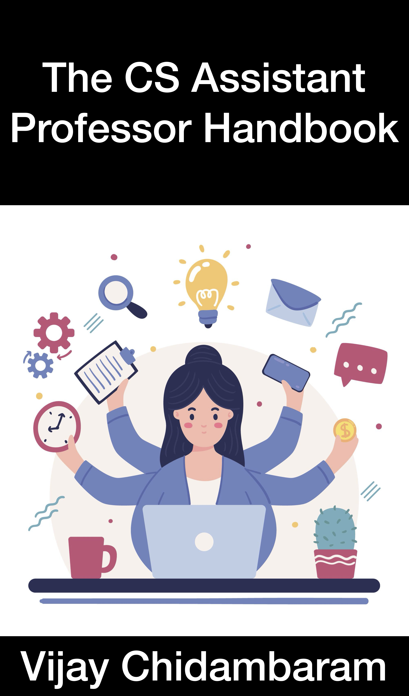

## Books

#### CS Assistant Professor Handbook

After getting tenure, I wrote the [CS Assistant Professor
Handbook](https://vijay03.github.io/asstprofbook/), a guidebook for
new professors who are just starting the job.  It covers topics like
what the job entails, and talks about different aspects like teaching
and research and how to balance them.
Junior professors have told me it is a useful read.

The book is available for free [online](https://vijay03.github.io/asstprofbook/).
If you would like to read it in ebook format, it is available on Amazon [here](https://www.amazon.com/dp/B0BPLYLKQK).
You can also order a physical copy from [Amazon](https://www.amazon.com/dp/B0CCCQR3T2).

